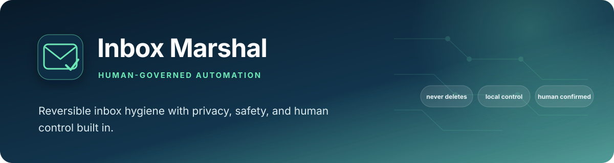
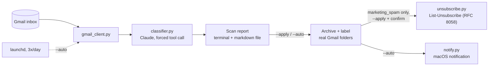

# Inbox Marshal

### *Human-governed inbox hygiene with reversible automation by default*

<div align="center">

[](https://www.python.org/)
[](https://www.anthropic.com/)
[](https://developers.google.com/gmail/api)
[]()

</div>

Gmail spam cleanup and receipt/subscription organization, built to be run
by anyone on their own inbox — not a personal script, a general-purpose
tool. Nothing in this repo is specific to any one person's email account.

## What it does

1. Scans your Gmail inbox (a configurable time window)
2. Classifies each email with Claude: malicious spam, marketing spam,
   payment receipt, subscription/bill, security alert, needs-your-attention,
   or leave-alone
3. Files things into real Gmail labels (folders) — spam gets archived out
   of the inbox, receipts/bills/security alerts get labeled but stay
   visible
4. Optionally unsubscribes from confirmed marketing senders via the
   standardized `List-Unsubscribe` mechanism — only with your explicit,
   per-sender confirmation
5. Can run itself on a schedule (`--auto`), filing things automatically and
   notifying you, so you review and delete from the actual Gmail folder on
   your own terms

## Why it exists

Two problems, one tool: inboxes accumulate marketing spam faster than
anyone manually unsubscribes from it, and receipts/bills get buried in the
same pile as everything else. Most "email cleanup" tools either delete
things without asking or require trusting a third-party SaaS with full
inbox access. This runs entirely on your own machine, with your own Google
Cloud project and your own API key — nothing about your inbox goes through
a third party.

## At a glance

| | |
|---|---|
| **Problem** | Marketing noise hides receipts, bills, security notices, and messages that need attention |
| **Approach** | Classify locally fetched Gmail messages, then apply least-destructive label/archive actions |
| **Control model** | Dry run, interactive apply, and non-blocking scheduled modes with different permissions |
| **Safety boundary** | Never permanently deletes; unsubscribe requires explicit per-sender confirmation |

## Competencies demonstrated

| Competency | Observable evidence |
|---|---|
| Human-centered automation | Reversible filing and confirmation requirements match action risk |
| Privacy engineering | User-owned OAuth project, local execution, trusted-domain floor, and minimal retention |
| Failure-safe design | Malformed model output defaults to `leave_alone` |
| Operational design | Interactive and unattended modes cannot accidentally share blocking behavior |
| Product thinking | Backlog cleanup and ongoing hygiene are treated as distinct user workflows |

### The competency this is really practicing: privacy-preserving automation design

The design skill this repo is built to demonstrate is running a real
classification pipeline — Gmail fetch, Claude classification, filing,
optional unsubscribe — entirely against credentials only I hold, with
nothing routed through a third party whose business model is inbox
access. Every classification decision, every trusted-domain override,
every unsubscribe confirmation is a line of Python that's inspectable
end to end, not a setting inside someone else's black box.

For context on the tradeoff that design choice makes: **SaneBox and
Clean Email** are both cloud services — your mail is fetched to their
servers to be classified, which is the whole reason they can offer a
zero-setup signup flow. **Gmail's own native Gemini cleanup features**
(Cleanup Suggestions, Smart Folders) are the more direct long-term
comparison, since they're free and built into the product already open
— this tool isn't trying to out-feature Google inside Google's own app;
it exists for the auditable, run-it-yourself part native tools
structurally can't offer.

## The safety model (read this before running it on your own inbox)

- **Never permanently deletes anything, in any mode.** The strongest
  action is archive + label. Archived mail lands in a real Gmail folder —
  `Marshal/Flagged-Spam`, `Marshal/Marketing-Spam`, etc. — that you browse
  and delete from yourself, using Gmail's own UI, on your own schedule.
  This tool only ever files; you decide, and you delete.
- **Unsubscribe only fires for `marketing_spam`**, via the standardized
  `List-Unsubscribe` header (RFC 8058) — the same mechanism Gmail's own
  "Unsubscribe" button uses. Never for `malicious_spam`: clicking anything
  in a phishing/scam email just confirms your address is active and
  invites more. Arbitrary unsubscribe links parsed out of an email body are
  never trusted — only the standardized header, since a hand-parsed link
  is exactly what a malicious sender can spoof.
- **Unsubscribe is never automatic**, in any mode, including `--auto`. It
  only runs via `--apply`'s interactive, per-sender confirmation — you see
  every sender by name before anything gets sent.
- **`trusted_domains` in `config.yaml`** is a hard floor independent of the
  model — add your bank, employer, doctor's office, etc., and those
  domains are never touched regardless of what the classifier thinks.
- **A malformed classification always fails toward the least destructive
  option.** If the model's output doesn't parse as a valid category, the
  email is left alone rather than risk-defaulting to something aggressive.

## Two operating modes

| Mode | When to use | Prompts? | Unsubscribe? |
|---|---|---|---|
| `--scan` | Dry run — see what would happen | No changes at all | No |
| `--apply` | You're at the terminal, want full control | Confirms before filing, confirms before unsubscribing | Yes, with confirmation |
| `--auto` | Scheduled/unattended (e.g. `launchd`, 3x/day) | Never blocks | Never |

## Architecture



## Real findings from building and testing this

- **Scope matters more than it looks.** An early version scanned only
  `in:inbox`, which silently missed real marketing spam that Gmail's own
  tab categorization (Promotions/Social/Updates) had already moved off the
  literal `INBOX` label — the mail was still cluttering the account, just
  not matched by that query. Fixed by scanning by date across the mailbox
  generally (excluding Spam/Trash, which Gmail's default search already
  does) instead of restricting to the literal inbox label.
- **A one-time backlog sweep and ongoing hygiene are different jobs.** A
  short lookback window (days) is right for a scheduled job catching new
  spam as it arrives; a much longer one-time window is needed to clear an
  actual accumulated backlog. `lookback_days` is one config value on
  purpose — run it wide once, then dial it back down for the recurring job.
- **Structured LLM output isn't guaranteed to have every field populated,
  even under a forced tool schema.** One classification call omitted its
  category field entirely rather than returning a valid enum value. Fixed
  by validating the returned category against the known set and failing
  toward the least destructive classification (`leave_alone`) rather than
  crashing or guessing.

## Setup

Full Google Cloud OAuth walkthrough:

1. **[console.cloud.google.com](https://console.cloud.google.com/)** → New Project
2. **APIs & Services → Library** → enable **Gmail API**
3. **Google Auth Platform → Branding** → set up the consent screen (External user type)
4. **Google Auth Platform → Audience** → add yourself under **Test users** (easy to miss — the app won't work without this)
5. **Google Auth Platform → Clients** → **Create client** → Application type: **Desktop app** → download the JSON as `credentials.json` in this repo's root

```bash
python3 -m venv venv
source venv/bin/activate
pip install -r requirements.txt
cp .env.example .env   # add your ANTHROPIC_API_KEY
python -m pytest tests/ -v
```

## Usage

```bash
python run_agent.py --scan --verbose     # see exactly what it finds, change nothing
python run_agent.py --apply              # file everything + interactive unsubscribe step
python run_agent.py --auto               # unattended — for scheduling
```

### Running it automatically (macOS)

```bash
cp com.example.inbox-marshal.plist ~/Library/LaunchAgents/com.<you>.inbox-marshal.plist
# edit it: replace /absolute/path/to/inbox-marshal with your actual path
launchctl load -w ~/Library/LaunchAgents/com.<you>.inbox-marshal.plist
```

Default schedule is 8am / 1pm / 6pm daily — edit the `StartCalendarInterval`
entries in the plist to change it.

## Contact

<div align="center">

### **Navi Sohi**
*Technical Program Manager & Automation Engineer*

<br>

[](https://www.linkedin.com/in/navisohi/)
[](https://github.com/PlainJane20)
[](https://mail.google.com/mail/?view=cm&fs=1&to=nks.ai.dev@gmail.com)

<br>

</div>
